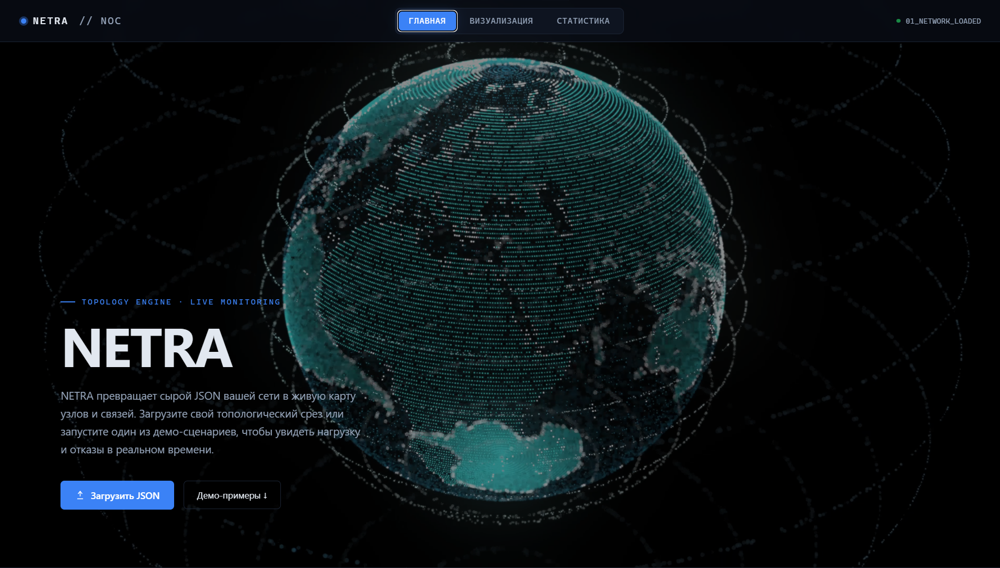
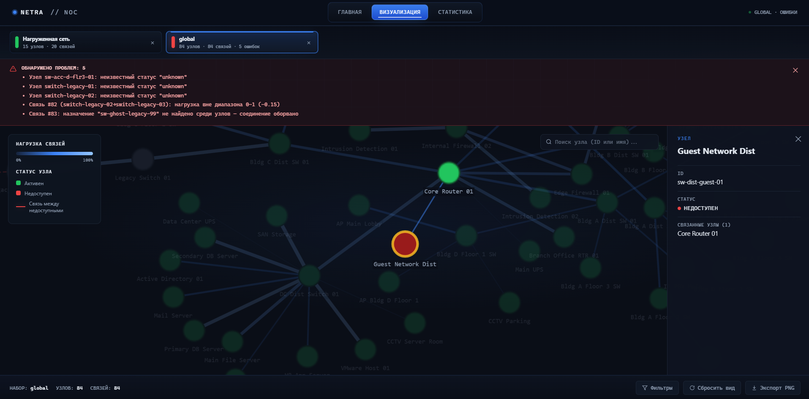

# NETRA

**Визуализатор абстрактных сетевых графов**

NETRA - самостоятельное клиентское веб-приложение для просмотра и анализа снимков сетевой топологии. Оно принимает один или несколько локальных JSON-файлов, строит интерактивные 2D-графы, показывает нагрузку связей, выделяет недоступные узлы и помогает находить ошибки в данных.

Приложение работает без сборщика, фреймворка и серверной базы данных. Все данные обрабатываются локально в браузере.

[Открыть NETRA на GitHub Pages](https://novikov0534.github.io/NETRA/)


## Возможности

### Работа с данными

- Одновременная загрузка до 30 JSON-файлов.
- Независимые вкладки для каждого открытого набора.
- Частичный импорт: ошибка одного файла не отменяет загрузку остальных.
- Ограничение до 20 МБ на файл и до 100 МБ за один выбор.
- Пять встроенных демо-сценариев и дополнительные наборы для проверки валидатора.
- История последних JSON в локальном хранилище браузера.
- Поддержка стабильных `datasetId`, имени набора, источника и произвольных объектов `meta`.

### Визуализация

- Интерактивный граф на Cytoscape.js.
- Цвет и толщина связи зависят от значения `load`.
- Недоступные узлы и связи между ними выделяются красным.
- Проблемные связи отображаются красной пунктирной линией.
- Поиск узла по идентификатору или имени.
- Фильтрация недоступных и изолированных узлов, а также связей по минимальной нагрузке.
- Панель сведений по клику на узел или связь.
- Экспорт текущего графа в PNG.

### Раскладка и вкладки

- Детерминированное исходное расположение: одна топология выглядит одинаково у разных пользователей.
- Уменьшение пересечений связей и случаев, когда чужая связь проходит через узел.
- Отдельное положение узлов, масштаб и смещение камеры для каждой вкладки.
- Сохранение камеры при переходе между визуализацией и статистикой.
- Перетаскивание вкладок для изменения порядка.
- Стрелки прокрутки при переполнении панели вкладок.

### Статистика и проверка данных

- Количество узлов и связей, доля недоступных узлов и средняя нагрузка.
- Диаграмма статусов и распределение нагрузки.
- Топ-5 нагруженных связей и наиболее связанных узлов.
- Список недоступных узлов.
- Неблокирующий валидатор: граф остаётся доступным даже при ошибках данных.
- Проверка отсутствующих узлов, дубликатов `id`, неизвестных статусов, неверной нагрузки, самозамкнутых связей и изолированных узлов.

## Скриншоты

| Главная | Визуализация |
|---|---|
|  |  |

| Проверка данных | Статистика |
|---|---|
|  |  |

## Запуск

### Готовая версия

Откройте [NETRA на GitHub Pages](https://novikov0534.github.io/NETRA/). Установка программ и зависимостей не требуется.

### Windows: `start.bat`

Для локального запуска через `start.bat` нужен Python 3, доступный как команда `python` или `py`.

1. Скачайте или клонируйте репозиторий.
2. Дважды нажмите `start.bat`.
3. Дождитесь автоматического открытия браузера.
4. Не закрывайте окно запуска во время работы.

Скрипт запускает локальный HTTP-сервер. Он использует первый свободный порт в диапазоне `8000-8010`, показывает итоговый адрес и записывает технические сообщения в игнорируемую Git папку `logs/`. Сервер останавливается сочетанием `Ctrl+C`.

```powershell
git clone https://github.com/Novikov0534/NETRA.git
Set-Location NETRA
.\start.bat
```

### Без Python

Откройте `index.html` двойным кликом. Пользовательские JSON и встроенные демо-наборы будут доступны, но браузер может ограничить отдельные возможности при работе через протокол `file://`. Для демонстрации рекомендуется GitHub Pages или `start.bat`.

## Формат JSON

Обязательны только массивы `nodes` и `links`:

```json
{
  "schemaVersion": "1.0",
  "datasetId": "monitoring:stand-01",
  "name": "Учебный стенд 01",
  "source": "monitoring",
  "nodes": [
    { "id": "server:web", "label": "Web", "status": "alive" },
    { "id": "server:db", "label": "Database", "status": "dead" }
  ],
  "links": [
    { "source": "server:web", "target": "server:db", "load": 0.73 }
  ]
}
```

Основные значения:

| Поле | Тип | Назначение |
|---|---|---|
| `nodes[].id` | string | Уникальный стабильный идентификатор узла |
| `nodes[].label` | string | Отображаемое имя |
| `nodes[].status` | `"alive"` или `"dead"` | Состояние узла |
| `links[].source` | string | Идентификатор исходного узла |
| `links[].target` | string | Идентификатор целевого узла |
| `links[].load` | number от `0` до `1` | Нагрузка связи |

Поля `schemaVersion`, `datasetId`, `name`, `source`, `generatedAt`, `meta` и `layout.positions` необязательны. Полное описание находится в [docs/json-format.md](docs/json-format.md).

## Интеграция

NETRA предназначена для использования как модуль визуализации общей системы. Профайлер или сервис мониторинга формирует канонический снимок, а визуализатор принимает его через JSON или API:

```js
NETRA.topology.openDataset(snapshot, {
  id: "monitoring:stand-01",
  name: "Учебный стенд 01",
  source: "monitoring"
});
```

Повторный вызов с тем же `id` обновляет существующую вкладку. Если состав узлов и связей не изменился, положение графа и камера сохраняются.

Модуль не собирает метрики из Docker самостоятельно, не подключается к БД, не хранит временные ряды и не реализует авторизацию. Эти задачи остаются у источников данных и серверной части общей системы. Подробный контракт приведён в [docs/integration.md](docs/integration.md).

## Демо-данные

Основные сценарии находятся в `data/`:

| Файл | Сценарий |
|---|---|
| `normal-network.json` | Разреженная нормальная сеть |
| `high-load-network.json` | Нагруженная сеть |
| `dead-nodes-network.json` | Большая доля недоступных узлов |
| `large-network.json` | Смешанная топология |
| `critical-network.json` | Намеренные ошибки данных |

Папка `data/validation/` содержит отдельные сценарии ошибок и увеличенный набор `global.json` на 84 узла.

## Структура проекта

```text
network-graph-visualizer/
├── index.html
├── css/
│   └── style.css
├── js/
│   ├── app.js
│   ├── graph.js
│   ├── stats.js
│   ├── filters.js
│   ├── validators.js
│   └── demo-data.js
├── data/
│   ├── *.json
│   └── validation/
├── docs/
│   ├── json-format.md
│   ├── integration.md
│   ├── usage.md
│   └── test-scenarios.md
├── assets/
│   ├── favicon.png
│   └── screenshots/
├── libs/
│   └── cytoscape.min.js
├── start.bat
└── README.md
```

## Документация

- [Формат JSON](docs/json-format.md)
- [Интеграция с другими модулями](docs/integration.md)
- [Инструкция по использованию](docs/usage.md)
- [Тестовые сценарии](docs/test-scenarios.md)

## Технологии

- HTML5, CSS3 и JavaScript без сборщика.
- Cytoscape.js для рендеринга и взаимодействия с графом.
- `localStorage` для истории недавно открытых наборов.
- File API и Canvas API для импорта JSON и экспорта PNG.
