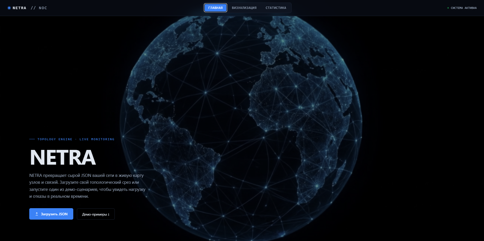
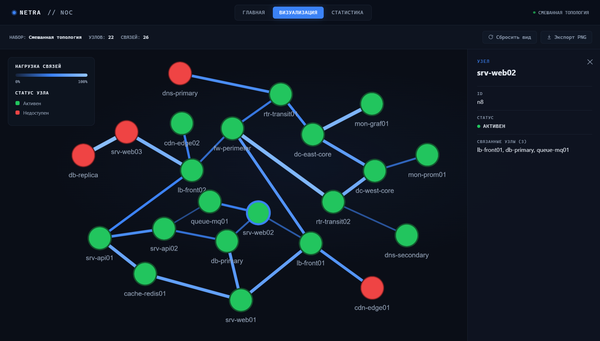
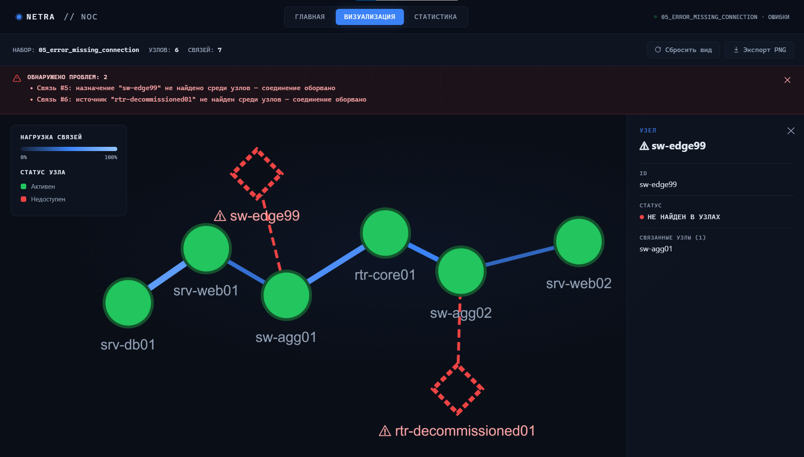
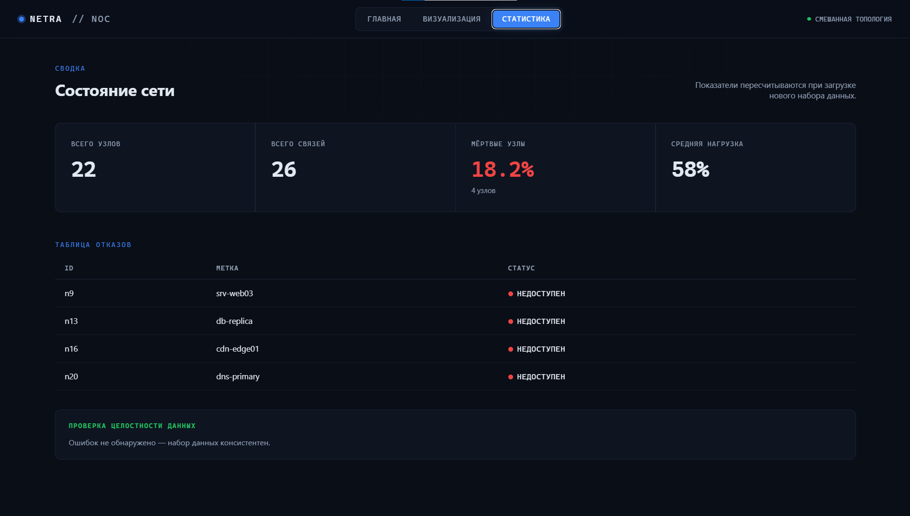

# NETRA

**Визуализатор абстрактных сетевых графов**

Веб-приложение, которое загружает локальный JSON-файл с описанием узлов и связей, строит интерактивный 2D-граф, показывает нагрузку цветом и толщиной линий и подсвечивает «мёртвые» узлы. Полностью самостоятельный веб-интерфейс — без бэкенда, без сборки, без установки зависимостей — плюс набор демо-JSON-файлов с разными сценариями (нагруженная сеть, много неактивных узлов, разреженный граф, ошибки в данных и т.д.).

<!--
📸 СКРИНШОТ 1 — сюда вставить общий превью/обложку проекта.
Лучше всего подойдёт широкий баннер: главная страница с фоновым видео и заголовком NETRA.
Рекомендуемое имя файла: docs/screenshots/cover.png
-->


---

## Возможности

- 🌐 Интерактивный 2D-граф сети на [Cytoscape.js](https://js.cytoscape.org/)
- 🎨 Тёмная NOC-тема: почти чёрный фон, синий акцент, живые узлы — зелёные, мёртвые — красные
- 📊 Толщина и цвет связей отражают нагрузку (load) в реальном времени
- 📁 Загрузка собственного JSON-файла или один из 4 встроенных демо-сценариев
- 🔍 Панель деталей по клику на узел или связь
- 📈 Вкладка статистики: количество узлов, связей, доля отказов, средняя нагрузка
- ⚠️ Проверка целостности данных «на лету» — сайт находит и подсвечивает битые связи, дубликаты id, некорректные значения нагрузки, изолированные узлы и т.д., не блокируя рендер графа
- 🖼️ Экспорт графа в PNG одним кликом

---

## Скриншоты

<!--
📸 СКРИНШОТ 2 — Главная страница
Что показать: hero-блок с видео-фоном, заголовком NETRA, кнопкой "Загрузить JSON" и рядом демо-карточек ниже.
Рекомендуемое имя файла: docs/screenshots/home.png
-->
### Главная


<!--
📸 СКРИНШОТ 3 — Визуализация
Что показать: вкладку "Визуализация" с построенным графом (лучше — один из "нагруженных" демо-наборов, чтобы было видно много узлов и цветные связи), легенду нагрузки в углу и открытую панель деталей узла справа.
Рекомендуемое имя файла: docs/screenshots/visualization.png
-->
### Визуализация


<!--
📸 СКРИНШОТ 4 — Обнаружение ошибок в данных
Что показать: загруженный демо-файл с ошибкой (например 05_error_missing_connection.json), красный баннер с описанием проблемы над графом, и «узел-призрак» с пунктирной красной рамкой на графе.
Рекомендуемое имя файла: docs/screenshots/error-detection.png
-->
### Обнаружение ошибок в данных


<!--
📸 СКРИНШОТ 5 — Статистика
Что показать: вкладку "Статистика" с 4 карточками (узлы/связи/мёртвые/нагрузка) и таблицей мёртвых узлов снизу.
Рекомендуемое имя файла: docs/screenshots/stats.png
-->
### Статистика


---

## Запуск

Приложение состоит из одного HTML-файла и не требует сервера или установки зависимостей.

1. Скачайте `index.html`, `netra-hero.mp4` и (опционально) `favicon.png`
2. Положите их в одну папку
3. Откройте `index.html` в браузере

> Единственная внешняя зависимость — [Cytoscape.js](https://cdnjs.cloudflare.com/ajax/libs/cytoscape/3.28.1/cytoscape.min.js), подключается через CDN, интернет нужен только при первой загрузке.

---

## Формат данных

Приложение принимает JSON-файл следующей структуры:

```json
{
  "nodes": [
    { "id": "srv-01", "label": "srv-01", "status": "alive" },
    { "id": "srv-02", "label": "srv-02", "status": "dead" }
  ],
  "links": [
    { "source": "srv-01", "target": "srv-02", "load": 0.73 }
  ]
}
```

| Поле | Тип | Описание |
|---|---|---|
| `nodes[].id` | string | Уникальный идентификатор узла |
| `nodes[].label` | string | Отображаемое имя узла |
| `nodes[].status` | `"alive"` \| `"dead"` | Статус узла |
| `links[].source` | string | id узла-источника связи |
| `links[].target` | string | id узла-назначения связи |
| `links[].load` | number (0–1) | Уровень нагрузки на связи |

---

## Тестовые-наборы

В репозитории есть готовые JSON-файлы для быстрой проверки (`/test_data`):

**Корректные сценарии**
| Файл | Сценарий |
|---|---|
| `01_network_loaded.json` | Нагруженная сеть |
| `02_network_dead_heavy.json` | Много неактивных узлов |
| `03_network_sparse.json` | Разреженный граф |
| `04_network_mixed.json` | Смешанная топология |

**Сценарии с намеренными ошибками** (проверка валидации)
| Файл | Что сломано |
|---|---|
| `05_error_missing_connection.json` | Связь ссылается на несуществующий узел |
| `06_error_duplicate_ids.json` | Повторяющиеся id узлов |
| `07_error_broken_schema.json` | Отсутствуют обязательные поля |
| `08_error_invalid_load.json` | Некорректные значения нагрузки, самозамкнутая связь |
| `09_error_isolated_nodes.json` | Узлы без единой связи |

Подробности по каждому файлу — в `test_data/README.md`.

---

## Технологии

- Чистый HTML / CSS / JavaScript (без сборки и фреймворков)
- [Cytoscape.js](https://js.cytoscape.org/) — рендер и layout графа
- CSS-переходы для анимаций (появление узлов, пульсация мёртвых узлов, fade между вкладками)

---

## Лицензия

<!-- Укажите лицензию проекта, например MIT -->
MIT
