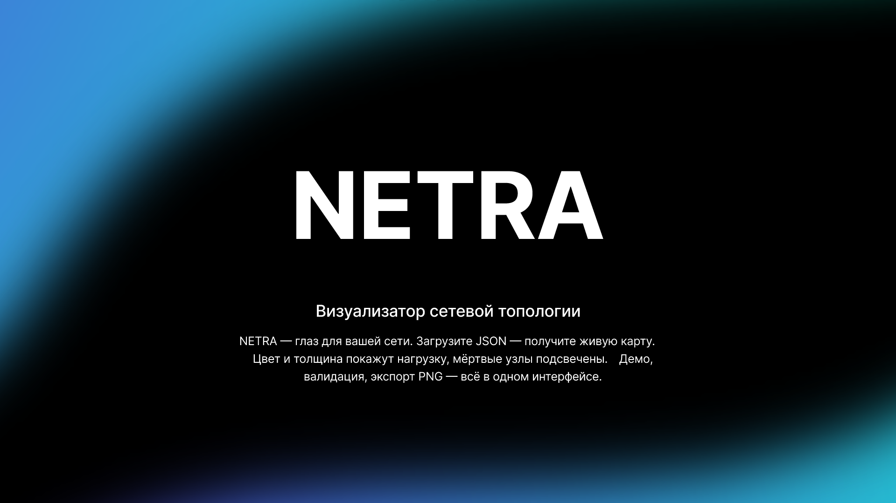

# NETRA

**Визуализатор абстрактных сетевых графов**

NETRA загружает один или несколько JSON-файлов с описанием узлов и связей, строит интерактивные 2D-графы, показывает нагрузку цветом и толщиной линий, а также подсвечивает недоступные и проблемные узлы.



## Возможности

- Интерактивный 2D-граф сети на Cytoscape.js.
- Одновременная загрузка одного или нескольких пользовательских JSON-файлов.
- Готовые демо-наборы в папке `data/`.
- Цвет и толщина связей зависят от значения `load`.
- Мертвые узлы подсвечиваются красным.
- Связи между двумя мертвыми узлами выделяются красной линией.
- Несколько открытых наборов доступны как вкладки визуализации.
- Детерминированная раскладка и сохранение положения каждого графа при переключении вкладок.
- Последние открытые JSON сохраняются в браузере и доступны на главной странице.
- Проверка данных: битые связи, дубликаты `id`, неверная нагрузка, изолированные узлы.
- Панель деталей по клику на узел или связь.
- Сводная статистика и экспорт графа в PNG.

## Структура проекта

```text
network-graph-visualizer/
├── index.html
├── css/
│   └── style.css
├── js/
│   ├── app.js
│   ├── graph.js
│   ├── stats.js
│   ├── filters.js
│   ├── demo-data.js
│   └── validators.js
├── data/
│   ├── normal-network.json
│   ├── high-load-network.json
│   ├── dead-nodes-network.json
│   ├── large-network.json
│   ├── critical-network.json
│   └── validation/
├── docs/
│   ├── json-format.md
│   ├── integration.md
│   ├── usage.md
│   └── test-scenarios.md
├── assets/
│   ├── favicon.png
│   └── screenshots/
├── libs/
│   └── cytoscape.min.js
├── .gitignore
├── start.bat
└── README.md
```

## Запуск

### Вариант 1: одной кнопкой

На Windows дважды нажмите:

```bat
start.bat
```

Скрипт сам запустит локальный сервер и откроет приложение в браузере. Обычно используется адрес `http://127.0.0.1:8000`, но если порт занят, `start.bat` выберет свободный порт в диапазоне `8000-8010` и покажет итоговый URL в консоли.

Окно `start.bat` нужно держать открытым во время работы с приложением. Для остановки сервера нажмите `Ctrl+C` в этом окне.

Локальный сервер нужен для загрузки демо-файлов из папки `data/`. Пользовательский JSON можно загрузить вручную через кнопку «Загрузить JSON».

### Вариант 2: без установки Python

Можно открыть `index.html` двойным кликом. В этом режиме основные демо-наборы берутся из встроенного файла `js/demo-data.js`, а загрузка пользовательского JSON работает через кнопку «Загрузить JSON».

`start.bat` все равно рекомендуется для итоговой демонстрации, потому что он показывает проект в том же режиме, в котором обычно работают веб-приложения.

## Документация

- [Формат JSON](docs/json-format.md)
- [Интеграция с другими модулями](docs/integration.md)
- [Инструкция по использованию](docs/usage.md)
- [Тестовые сценарии](docs/test-scenarios.md)

## Технологии

- HTML, CSS, JavaScript без сборщика.
- Cytoscape.js хранится локально в `libs/cytoscape.min.js`.
- Данные хранятся в формате JSON.
